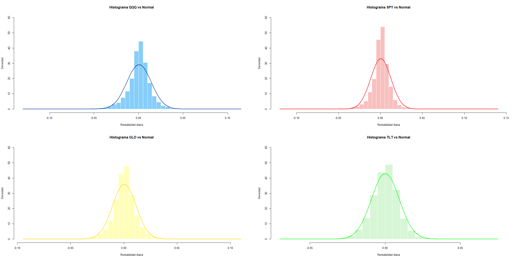
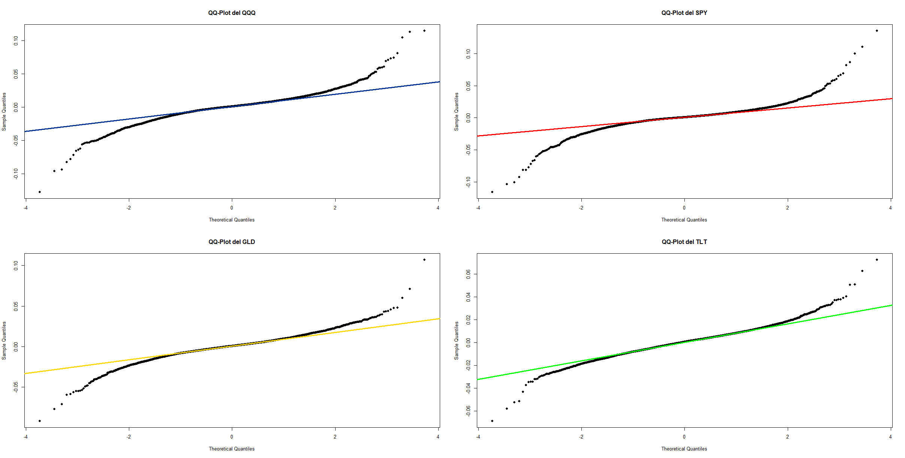
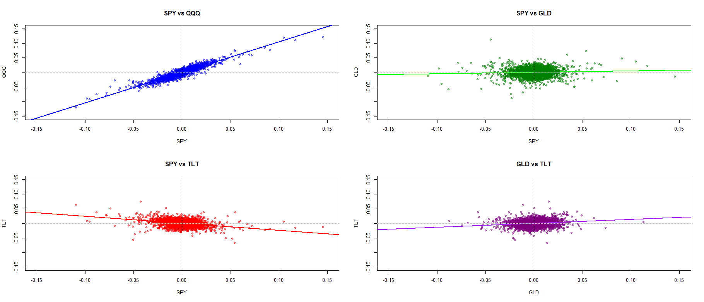
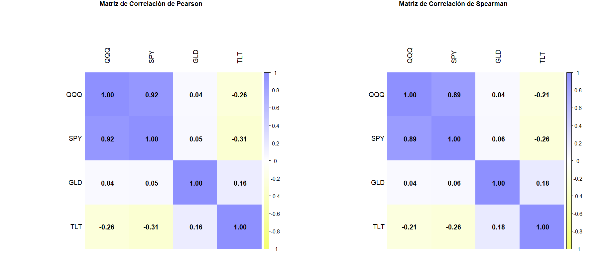
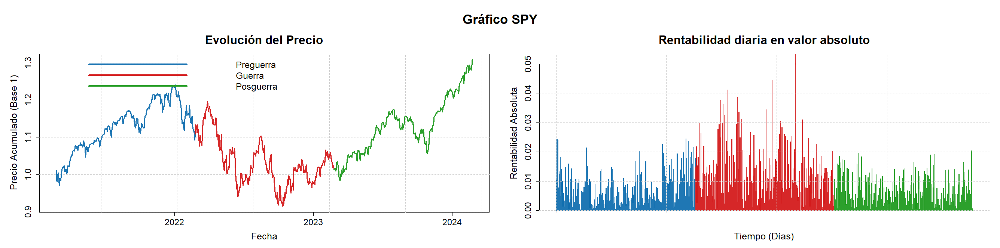
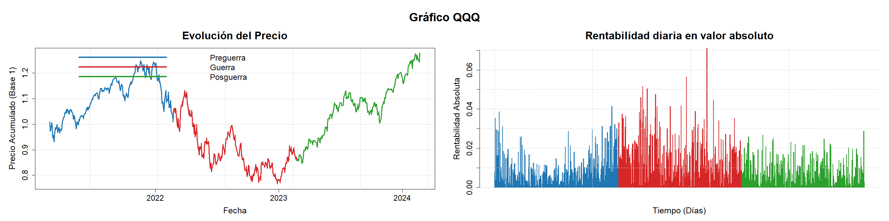
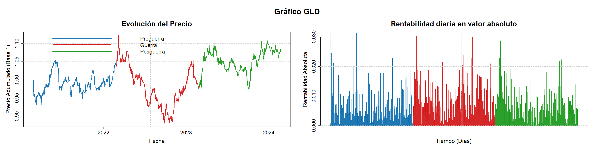
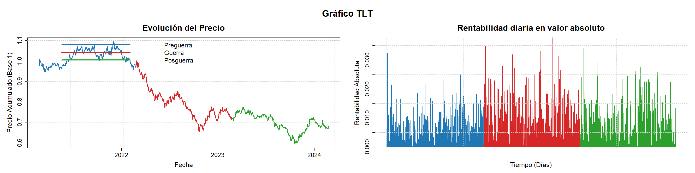

# Análisis Estadístico de la Rentabilidad, el Riesgo y la Asociación entre Activos Financieros (2005–2025)
### *Análisis Global y Comparación de Regímenes de Mercado en torno a la Guerra de Ucrania*

> **Trabajo de Fin de Grado (TFG)** — Grado en Administración y Dirección de Empresas (ADE)  
> **Universidad de Córdoba** | Curso Académico 2025/2026  
> **Autor:** Jaime Nieto Godino  
> **Directora / Tutora:** Dña. Sonia Navajas Torrente  

---

## 📌 Resumen Ejecutivo (Executive Summary)

Este proyecto desarrolla un análisis econométrico y cuantitativo exhaustivo sobre el comportamiento de distintas clases de activos financieros cotizados (**ETFs**) a lo largo de más de dos décadas (**2005–2025**, >5.200 observaciones diarias), contrastando las condiciones de mercado estructurales con fases de estrés extremo originadas por un shock geopolítico exógeno: la **Guerra de Ucrania** (2022).

El estudio combina técnicas univariantes y multivariantes para evaluar:
1. **La forma de las distribuciones empíricas** (asimetría, exceso de curtosis y contrastes formales de normalidad).
2. **La dependencia lineal y no lineal por rangos** (coeficientes de Pearson y Spearman).
3. **El comportamiento en colas y situaciones extremas** mediante **momentos sistemáticos de orden superior** frente al benchmark de renta variable estadounidense (`SPY`): *comovimiento sistemático*, *coasimetría estandarizada* y *cocurtosis sistemática*.
4. **La estabilidad temporal y cambios de régimen** condicionados al conflicto bélico (Pre-guerra, Impacto inicial y Normalización), analizando la variación en media y volatilidad (contrastes de Levene y t de Welch).

---

## 🎯 Universo de Inversión Analizado

Se seleccionaron cuatro vehículos cotizados de máxima liquidez representativos de las principales clases de activos globales:

| Ticker | Nombre del ETF | Clase de Activo / Subyacente | Rol Estratégico en Gestión de Carteras |
| :--- | :--- | :--- | :--- |
| **`SPY`** | SPDR S&P 500 ETF Trust | Renta Variable EE. UU. (Gran Capitalización) | **Benchmark de mercado** y motor troncal de rentabilidad estructural. |
| **`QQQ`** | Invesco QQQ Trust | Renta Variable Tecnológica (Nasdaq-100) | Factor de crecimiento (*Growth* / *AI / Tech Beta*) de alta volatilidad. |
| **`GLD`** | SPDR Gold Shares | Materia Prima / Metal Precioso (Oro Físico) | **Activo refugio** y cobertura (*hedge*) contra inflación y riesgo geopolítico. |
| **`TLT`** | iShares 20+ Year Treasury Bond ETF | Renta Fija Soberana (Deuda EE. UU. > 20 años) | **Activo estabilizador** y cobertura clásica de duración (*flight-to-quality*). |

---

## 🔬 Metodología Cuantitativa

### 1. Rendimientos Continuos Logarítmicos

$$
r_t = \ln\left(\frac{P_t}{P_{t-1}}\right)
$$

*Justificación:* Garantiza aditividad temporal a lo largo del horizonte multiperiodo y mejores propiedades estadísticas para el modelado econométrico continuo.

### 2. Medidas Univariantes y Contraste de Normalidad
- **Riesgo y Dispersión:** Varianza ($\sigma^2$), Desviación típica ($\sigma$), Rango Intercuartílico ($RI = Q_3 - Q_1$) y Ratio de Sharpe ($R_f = 0$).
- **Forma de la Distribución:** Asimetría de Fisher ($\gamma_1$) y exceso de curtosis ($\gamma_2 = \text{curtosis} - 3$).
- **Inferencia de Normalidad:** Test de Kolmogórov-Smirnov con corrección de Lilliefors (`nortest::lillie.test`).

### 3. Dependencia Bivariante
- **Correlación Lineal de Pearson ($r$):** Sensible a la covarianza lineal paramétrica.
- **Correlación de Rangos de Spearman ($\rho$):** Medida no paramétrica de dependencia monótona, robusta ante valores extremos y no normalidad.

### 4. Momentos Sistemáticos de Orden Superior (Benchmark: SPY)
Permiten capturar el riesgo asimétrico de cola (*tail risk*) que los modelos gaussianos y el CAPM clásico omiten:

- **Comovimiento Sistemático ($\delta_{i,j}^{(2,2)}$):** Mide la tendencia de dos activos a atravesar episodios de alta volatilidad de forma simultánea:

$$
\delta_{i,j}^{(2,2)} = \frac{\sum_{t=1}^n (r_{i,t} - \bar{r}_i)^2 (r_{j,t} - \bar{r}_j)^2}{\sum_{t=1}^n (r_{j,t} - \bar{r}_j)^4}
$$

- **Coasimetría Estandarizada ($\delta_{i,j}^{(1,2)}$):** Sensibilidad de los rendimientos del activo $i$ ante repuntes bruscos de volatilidad en el mercado $j$ (Fry et al., 2010):

$$
\delta_{i,j}^{(1,2)} = \frac{\sum_{t=1}^n (r_{i,t} - \bar{r}_i)(r_{j,t} - \bar{r}_j)^2}{n \cdot S_i \cdot S_j^2}
$$

- **Cocurtosis Sistemática ($\delta_{i,j}^{(1,3)}$):** Tendencia a acompañar o contrarrestar los movimientos más extremos del mercado (Fang & Lai, 1997):

$$
\delta_{i,j}^{(1,3)} = \frac{\sum_{t=1}^n (r_{i,t} - \bar{r}_i)(r_{j,t} - \bar{r}_j)^3}{\sum_{t=1}^n (r_{j,t} - \bar{r}_j)^4}
$$

### 5. Análisis por Regímenes de Mercado (Guerra de Ucrania)
Segmentación en 3 ventanas temporales de 252 sesiones bursátiles:
- **Periodo -1 (Pre-guerra):** 2021-02-24 a 2022-02-23 (Tensiones geopolíticas e inflación inicial).
- **Periodo 0 (Impacto bélico inicial):** 2022-02-24 a 2023-02-23 (Comienzo de hostilidades y ciclo agresivo de subidas de tipos de la Fed).
- **Periodo 1 (Normalización / Post-impacto):** 2023-02-24 a 2024-02-23 (Asimilación y desescalada de volatilidad).

---

## 📊 Principales Resultados Empíricos

### 1. Estadísticos Descriptivos Globales (2005–2025)

| Métrica | QQQ | SPY | GLD | TLT |
| :--- | :---: | :---: | :---: | :---: |
| **Media diaria** | 0,0552 % | 0,0401 % | 0,0424 % | 0,0134 % |
| **Rentabilidad anualizada** | **13,90 %** | 10,11 % | 10,69 % | 3,37 % |
| **Desviación típica diaria** | 1,366 % | 1,205 % | 1,110 % | 0,927 % |
| **Rango Intercuartílico (RI)** | 0,0125 | 0,0097 | 0,0113 | 0,0110 |
| **Ratio de Sharpe diario** | **0,0404** | 0,0333 | **0,0382** | 0,0144 |
| **Asimetría ($\gamma_1$)** | -0,2513 | -0,3040 | -0,2924 | **+0,0030** |
| **Exceso de Curtosis ($\gamma_2$)** | 7,69 | **14,65** | 5,77 | 3,38 |

### 2. Contraste de Normalidad y Análisis de Distribuciones

| Activo | Estadístico D | p-valor | Conclusión Econométrica |
| :--- | :---: | :---: | :--- |
| **QQQ** | 0,0874 | < 0,001 | Rechazo contundente de normalidad ($H_0$). Colas pesadas. |
| **SPY** | 0,1096 | < 0,001 | Máxima leptocurtosis y mayor alejamiento de la normal gaussiana. |
| **GLD** | 0,0627 | < 0,001 | Rechazo de normalidad. Asimetría hacia caídas bruscas post-refugio. |
| **TLT** | 0,0346 | < 0,001 | El más cercano a la simetría, pero con colas más gruesas que la normal. |

#### Figuras 1 y 2: Histogramas de Densidad y Gráficos Cuantil-Cuantil (QQ-Plots)
| Figura 1: Histogramas vs Distribución Normal | Figura 2: QQ-Plots de Normalidad |
| :---: | :---: |
|  |  |

---

### 3. Matrices de Correlación y Diagramas de Dispersión

| Par de Activos | Pearson ($r$) | Spearman ($\rho$) | Interpretación en Asignación de Activos |
| :--- | :---: | :---: | :--- |
| **SPY vs QQQ** | **+0,92** | **+0,89** | **Dependencia casi total.** No aporta diversificación ante caídas sistémicas. |
| **SPY vs TLT** | **-0,31** | **-0,26** | **Cobertura histórica.** Descorrelación negativa estructural (*flight-to-quality*). |
| **SPY vs GLD** | **+0,04** | **+0,04** | **Independencia estadística.** El oro se desvincula de los ciclos de renta variable. |
| **GLD vs TLT** | **+0,16** | **+0,18** | **Leve asociación positiva.** Ambos son refugios con catalizadores distintos. |

#### Figuras 3 y 4: Diagramas de Dispersión Bivariante y Matrices de Correlación
| Figura 3: Diagramas de Dispersión | Figura 4: Matrices de Correlación (Pearson / Spearman) |
| :---: | :---: |
|  |  |

---

### 4. Momentos Sistemáticos de Orden Superior frente a SPY

| Activo de Estudio | Comovimiento Sistemático | Coasimetría Estandarizada | Cocurtosis Sistemática |
| :--- | :---: | :---: | :---: |
| **QQQ** | **0,9264** | **-0,2453** | **+0,9441** |
| **GLD** | 0,1701 | +0,0332 | +0,0625 |
| **TLT** | 0,1407 | **+0,2586** | **-0,2138** |

---

### 5. Comportamiento y Volatilidad por Regímenes de Mercado (Guerra de Ucrania)

| SPY (S&P 500) | QQQ (Nasdaq-100) |
| :---: | :---: |
|  |  |
| **GLD (Oro Físico)** | **TLT (Bonos del Tesoro 20+ Años)** |
|  |  |

---

## 💡 Implicaciones para la Gestión de Carteras (Portfolio Management Takeaways)

1. **La falacia de diversificar Renta Variable con Tecnología (SPY + QQQ):**  
   Con una cocurtosis sistemática de **0,9441** y coasimetría de **-0,2453**, QQQ acompaña los eventos extremos negativos del SPY y amplifica las caídas de volatilidad. La aparente diversificación sectorial no protege el capital en episodios de *drawdown*.
2. **La superioridad ajustada al riesgo del Oro (GLD):**  
   El oro ofreció durante 20 años una rentabilidad anualizada superior al SPY (10,69 % vs 10,11 %) con menor volatilidad (1,11 % vs 1,20 %) y un ratio de Sharpe superior (0,0382 vs 0,0333). Sus momentos superiores frente al mercado son prácticamente neutros ($\approx 0$), consolidándolo como un diversificador puro no dependiente del ciclo bursátil.
3. **El doble filo de la Deuda Pública a Largo Plazo (TLT) y la ruptura de la cartera 60/40:**  
   Históricamente, TLT exhibe la firma numérica del *flight-to-quality* (coasimetría positiva de +0,2586 y cocurtosis negativa de -0,2138). Sin embargo, su bajo Sharpe global (0,0144) y su extrema vulnerabilidad a las subidas de tipos de interés (riesgo de duración) evidenciaron durante el shock de Ucrania que los bonos soberanos no protegen cuando la crisis viene acompañada de presiones inflacionarias.
4. **Superación del paradigma de Markowitz:**  
   La presencia confirmada de colas pesadas (leptocurtosis de 14,65 en SPY) invalida la hipótesis de normalidad gaussiana. En gestión de riesgos profesional, el uso de métricas como el *Value-at-Risk* (VaR) paramétrico gaussiano subestima severamente las pérdidas potenciales, requiriendo modelos basados en *Conditional Value-at-Risk* (CVaR / Expected Shortfall) y momentos superiores.

---

## 📁 Estructura del Repositorio

```text
├── data/
│   ├── datos_tfg.csv                  # Serie histórica diaria de log-returns (2005–2025, 5.233 observaciones)
│   └── datos_spss_regimenes.csv       # Datos segmentados por regímenes en torno a la Guerra de Ucrania
├── docs/
│   ├── TFG JAIME.pdf                  # Memoria académica completa en formato PDF
│   └── TFG JAIME.docx                 # Documento original editable en Word
├── figures/                           # Todas las figuras del TFG (extraídas de la memoria y generadas por R)
│   ├── figura_1_histogramas_densidad.png
│   ├── figura_2_qqplots_normalidad.png
│   ├── figura_3_diagramas_dispersion.png
│   ├── figura_4_matrices_correlacion.png
│   ├── figura_5_regimenes_SPY.png
│   ├── figura_6_regimenes_QQQ.png
│   ├── figura_7_regimenes_GLD.png
│   ├── figura_8_regimenes_TLT.png
│   └── anexo_c_*.png                 # Tablas y contrastes inferenciales exportados de SPSS
├── 01_descarga_datos.py              # Script en Python para descarga y cálculo de log-returns vía yfinance
├── 02_analisis_tfg.R                 # Script íntegro en R con todo el código del Anexo B (Códigos 2 al 9)
├── .gitignore                         # Filtro de exclusión de temporales (Office, R, Python)
└── README.md                          # Documentación ejecutiva, metodológica y resultados del proyecto
```

---

## 🚀 Guía de Reproducción

### Requisitos de Software
- **R** (versión $\ge$ 4.0.0) con los paquetes:
  ```r
  install.packages(c("moments", "corrplot", "nortest"))
  ```
- **Python** (versión $\ge$ 3.8) con las librerías:
  ```bash
  pip install yfinance numpy pandas
  ```

### Descarga y Extracción de Datos en Python
Para ejecutar la extracción de cotizaciones y cálculo de rentabilidades logarítmicas:
```bash
python 01_descarga_datos.py
```

### Ejecución del Análisis en R
Para ejecutar todo el análisis estadístico, contrastes y generación de gráficos:
```bash
Rscript 02_analisis_tfg.R
```
*O bien, abrir `02_analisis_tfg.R` en RStudio y ejecutar línea a línea o mediante `Source`.*

---

## 📚 Referencias Clave

- **Markowitz, H.** (1952). *Portfolio Selection*. The Journal of Finance, 7(1), 77–91.
- **Kraus, A., & Litzenberger, R. H.** (1976). *Skewness preference and the valuation of risk assets*. The Journal of Finance, 31(4), 1085–1100.
- **Harvey, C. R., & Siddique, A.** (2000). *Conditional Skewness in Asset Pricing Tests*. The Journal of Finance, 55(3), 1263–1295.
- **Fang, H., & Lai, T.** (1997). *Co-Kurtosis and Capital Asset Pricing*. Financial Review, 32(2), 293–307.
- **Baur, D. G., & Lucey, B. M.** (2010). *Is Gold a Hedge or a Safe Haven? An Analysis of Stocks, Bonds and Gold*. Financial Review, 45(2), 217–229.
- **Lilliefors, H. W.** (1967). *On the Kolmogorov-Smirnov Test for Normality with Mean and Variance Unknown*. JASA, 62(318), 399–402.
